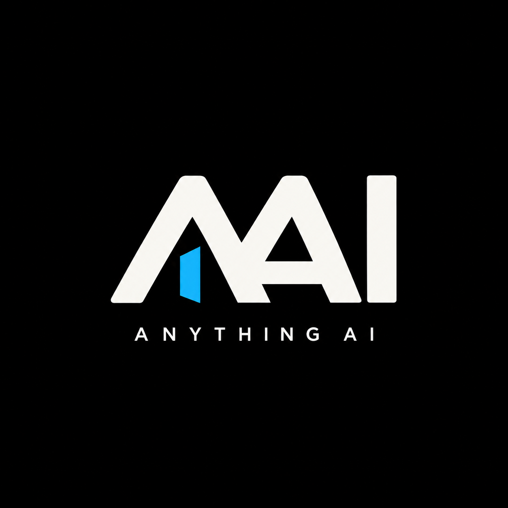

# Anything AI — Build With AAI

**A community for building useful AI tools, trading research, music collaborations, and creative experiments.**

AAI welcomes developers, researchers, designers, musicians, testers, meme creators, and people with a useful question. Bring an idea, show your evidence, and help build something others can use.

> **Future blockchain name: UNDECIDED — Zoora Blockchain or AAI Blockchain.** The Solana/Pump.fun community experiment is separate from that future network and its genesis-native currency. No migration, conversion, bridge, native-coin allocation, equity, governance, or revenue entitlement is offered by this roadmap.

## Why this project exists

The founder is tired of rugs, scam coins, and communities investing money, time, and energy in projects that disappear after the attention fades. AAI aims to earn trust through inspectable work: code, decisions, setbacks, expenses, and actual deliverables. This motivation is not a certification that any token or experiment is safe.

**AAI is the founder's only currently planned community coin launch.** A separate software-related coin would only be considered if the community identifies a real purpose and it passes a separate public proposal, review, and owner decision. Software does not need its own coin to belong here. The separate future-blockchain research is not a scheduled second launch; no native launch is approved by this statement.

## Start here

| What you need | Read |
| --- | --- |
| The full eight-part roadmap | [Roadmap](ROADMAP.md) |
| What actually exists | [Current status](docs/CURRENT_STATUS.md) |
| Work to pick up | [Planning board](docs/community/PROJECT_BOARD.md) and [40 task briefs](tasks/BACKLOG.md) |
| How to participate | [Contributing](CONTRIBUTING.md) and [proposal process](proposals/README.md) |
| Funding and community benefit | [Creator-fee funding proposal](docs/FUNDING.md) |
| Decisions and limits | [Decision register](docs/DECISIONS.md) and [project boundaries](DISCLAIMER.md) |
| Verified destinations | [Official links](OFFICIAL-LINKS.md) and [canonical token record](docs/token/TOKEN-INFO.md) |
| Telegram orientation | [Community setup](docs/community/TELEGRAM.md) |
| Security and reuse | [Security policy](SECURITY.md) and [license status](LICENSE-STATUS.md) |

## What exists today

This repository contains public planning and contribution material. A separate **private AAI Scan prototype** implements Scan → Watch → Compare, saved observations, a short timeline, and change alerts. The earlier development record reports 29 passing offline tests and one successful live public market-data request. Those checks were not rerun for this documentation update.

**AAI Scan is not a validated live public service.** Hosting remains paused. Live Telegram delivery, production provider coverage, persistence/restore, and sustained operation remain to be demonstrated. It does not execute trades, verify Pump.fun origin, identify creator trades, or predict runners.

The founder has started an **Anything AI** Telegram group. Its invitation URL is not yet verified in the official-links register. This update supplies no deployed assistant, trading strategy, agent marketplace, music service, blockchain, or funded trading account. No official mint has been authenticated here; missing token details remain **TBD — DO NOT GUESS**.

## What we are exploring

| Workstream | Current stage | First useful output |
| --- | --- | --- |
| [AAI Scan](projects/AAI_SCAN.md) | Private prototype; validation pending | Repeatable scan/watch/compare and recovery checks |
| [Multi-Brain Experiment](projects/MULTI_BRAIN_LAB.md) | RESEARCH direction; early founder priority | Verified source inventory, then two reproducible modules and benchmark |
| [Personal Trading Assistant](projects/PERSONAL_ASSISTANT.md) | IDEA / PROPOSED product direction | User-named, evidence-based research assistant for Pump.fun and spot/leverage |
| [Agent work controls](projects/AGENT_WORKFLOW.md) | RESEARCH | A narrow, budgeted workflow with review and durable records |
| [Solana Trading Lab](projects/SOLANA_TRADING_LAB.md) | RESEARCH | Offline/paper experiments including jellyfish-inspired ideas |
| [XAUUSD EA Lab](projects/XAUUSD_EA_LAB.md) | IDEA / RESEARCH | One strategy specification and reproducible evaluation |
| [Community tools](projects/COMMUNITY_TOOLS.md) | IDEA | One useful bot, dashboard, tracker, or media tool |
| [AAI service utility](projects/AAI_UTILITY.md) | DESIGN EXPLORATION | A real service and a test-asset payment design |
| [Launch study](research/LAUNCH_STUDY.md) | PROPOSED RESEARCH | A defined cohort including failures and missing data |
| [Agent economy and market forum](projects/AGENT_ECONOMY.md) | PROPOSED RESEARCH | Structured agent discussions and a test-balance task market |
| [Open music collaboration](projects/MUSIC_COLLABORATION.md) | IDEA | An original track, open-verse submission, and approved credited collaboration |
| [Civilization visualization](projects/CIVILIZATION.md) | FUTURE VISION | A small display driven by real recorded agent work |

The multi-brain experiment is an early research priority, not an implemented trading system. Research, prototype, deployment, and profitability are different claims. No project has a committed delivery date.

## Funding intent

The founder intends to use creator fees for development, marketing, and relevant DEX costs. A newer proposal would allocate an undecided portion to a dedicated trading account using reviewed technology, potentially an XAUUSD system if testing supports it. Possible uses of any profits include further development, developer thank-you gifts, community rewards, and disclosed token purchases at prevailing market prices.

This is a **proposal**, not evidence of a funded account, profitable bot, payout schedule, buyback program, or community-controlled treasury. Allocated funds can be lost. Read the [funding record](docs/FUNDING.md) for unresolved allocation, control, loss-limit, accounting, and distribution decisions.

## Build with us

Community members propose and discuss; contributors build; owner/maintainers review and accept. Current governance is community-driven, with maintainer acceptance. Contributions do not automatically create compensation, token, or revenue rights.

Start with a small outcome that can be checked. Preserve sources and failed results. Major architecture and economic changes need an explicit decision before implementation. Keep wallet secrets and private data out of contributions.

**Documentation snapshot: September 22, 2026.** The board and 40 task bodies are repository planning documents, not 40 opened GitHub issues or a native Projects board. Label definitions and review policies do not prove platform enforcement. See the [development-plan index](DEVELOPMENT_PLAN.md).
